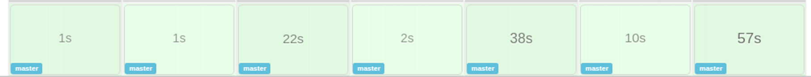
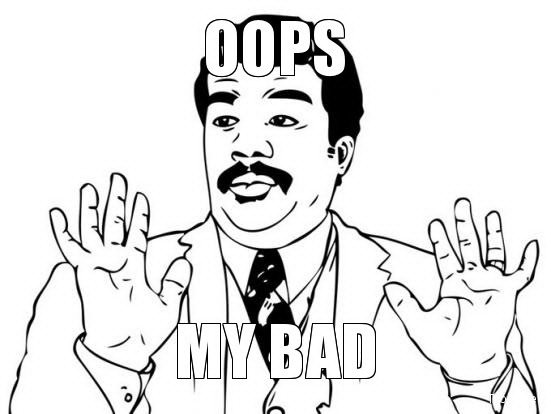
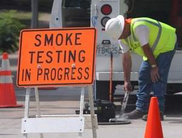

+++
## CI/CD Acceptance Tests

+++

### Acceptance Testing with CI/CD

  * Automated tests ensuring the environment/application is successfully built to allow for manual User Acceptance testing
+++

### END-TO-END-TESTING

+++

### END-TO-END-TESTING EXAMPLE
  * Trigger: Deployed application with code changes for calculations
  * Test: Test application initiates data flow with known data and expects correct values to appear at the end of the flow
  * Results:
    * Success: Data retrieved from end of flow has correct value
    * Failure: Data retrieved from end of flow has incorrect value or data does not appear at the end of the flow
+++

### SMOKE TESTING

  * Run after deploying new apps/infrastructure
  * Ensures all back end services wire together successfully
+++

### SMOKE TEST EXAMPLE
  * Trigger: Deployed application with new database connection URL
  * Test: Test application runs and attempts to query database with JDBC template call
  * Results:
    * Success: Retrieves data from JDBC query - Environment is UP!
    * Failure: Connection refused - Environment is DOWN!
+++

### Health Check

+++

### UI TESTING

+++

### HOW DOES IT ALL LOOK ?
+++

### CI/CD Acceptance Tests
  * Questions / Feedback ?
