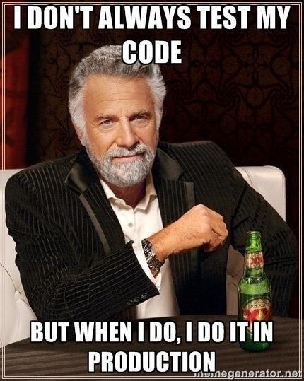

+++
## CI/CD Acceptance Tests

+++

### Acceptance Testing

  * Definition
    * Automated tests ensuring the environment/application is successfully built to allow for manual User Acceptance testing
    * Front end: UI Tests
    * Back end: Smoke/End-to-End Tests
+++

### Acceptance Testing with CI/CD

  * CI Pipeline
    * Acceptance tests come before deploying to UAT/TEST environment
      * Assuming DEV --> UAT --> PRE-PROD environments
    * Acceptance tests can be run in DEV environment
    * Ensures environment/application is up and running for manual user acceptance testing to be performed
    * Automated tests that ensure newly deployed code works in environment
+++

### SMOKE TESTING

  * Run after deploying new apps/infrastructure
  * Ensures all back end services wire together successfully
+++

### SMOKE TEST EXAMPLE
  * Trigger: Deployed application with new database connection URL
  * Test: Test application runs and attempts to query database with JDBC template call
  * Results:
    * Success: Retrieves data from JDBC query - Environment is UP!
    * Failure: Connection refused - Environment is DOWN!
+++

### END-TO-END-TESTING

  * Run after new code is deployed
  * Ensures data flows with the right values from beginning to end
+++

### END-TO-END-TESTING EXAMPLE
  * Trigger: Deployed application with code changes for calculations
  * Test: Test application initiates data flow with known data and expects correct values to appear at the end of the flow
  * Results:
    * Success: Data retrieved from end of flow has correct value
    * Failure: Data retrieved from end of flow has incorrect value or data does not appear at the end of the flow
+++

### Health Check

  * An alternative to Smoke testing
  * Works well on web applications
    * Create a health route which calls each service and posts the status codes to the route.
    * Goes beyond acceptance test functionailty and lends itself well to application support
+++

### Health Check Example
  * Trigger: Deployed application
  * Test: Call the Endpoint and check the response is a 200
  * Results:
    * Success: All service calls return 200 - Results in App is HEALTHY!
    * Failure: If one service returns a 500 - App is SICK!
+++

### UI TESTING

+++

### CI/CD Acceptance Tests
  * Questions?
